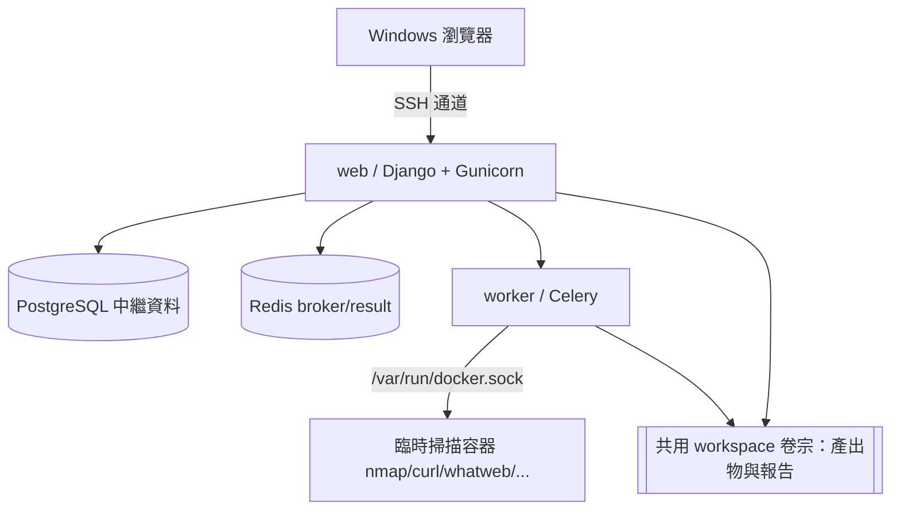

# KaliRecon Web

> 自架、單一使用者、**僅供授權偵察**的網頁工作流程管理工具。
> 在 Kali Linux 上執行，透過 SSH 通道從 Windows 瀏覽器操作。

---

## 1. 專案目的
KaliRecon Web 讓你為**每個已獲授權的目標**建立一個偵察任務，輸入目標 IP、目標
URL、要執行的工具與掃描設定檔，並由背景 Celery worker 為每個工具步驟啟動**臨時
掃描容器**。每個任務都有自己的頁面、狀態、步驟歷史、日誌、產出物、正規化結果與
合併 HTML 報告。

它是**偵察工具的控制平面**，不是漏洞利用框架。

## 2. ⚠️ 授權限定警告
**僅可對你擁有或已獲明確書面授權評估的系統使用。** 未經授權的掃描在多數司法管轄
區皆屬違法。UI 上會顯示橫幅，建立任務時必須勾選授權確認。

## 3. 架構

- Django 請求程序**永不**同步等待掃描指令。
- 每個工具步驟在自己的臨時容器中執行，容器以任務/步驟 UUID 標記，掛載 workspace
  卷宗，並帶入 `extra_hosts`（主機名稱 → 目標 IP）。

## 4. 先決條件
- Kali/Debian 類主機
- Docker Engine + Docker Compose plugin
- Git
- （從 Windows 連線用）OpenSSH 用戶端

## 5. 快速安裝（明日到場檢查清單）
```text
1. 啟動 Kali
2. 確認 Docker：docker info
3. 取得原始碼：git clone <repo-url> && cd Kali-Recon-Web
4. 執行安裝腳本：./scripts/install.sh
5. 啟動堆疊：docker compose up -d
6. 從 Windows 建立 SSH 通道（見第 8 節）
7. 開啟瀏覽器 http://127.0.0.1:8080
8. 建立已授權的偵察任務
```
`./scripts/install.sh` 會：檢查環境、複製 `.env`、產生 Django SECRET 與資料庫
密碼、詢問或產生管理員密碼、由 git remote 推導 GHCR 映像名稱、提供本地建置或
GHCR 拉取、啟動服務並印出 SSH 通道指令。

## 6. 本地建置安裝
```bash
cp .env.example .env            # 若 install.sh 尚未建立
# 編輯 .env 填入 DJANGO_SECRET_KEY 等（install.sh 會自動產生）
docker compose build
docker compose --profile scanner build scanner-build   # 建置 Kali 掃描映像
docker compose up -d
```

## 7. 使用 GHCR 預建映像
```bash
# 在 .env 設定：
#   APP_IMAGE=ghcr.io/<owner>/<repo>-app:latest
#   SCANNER_IMAGE=ghcr.io/<owner>/<repo>-scanner:latest
docker compose -f compose.yml -f compose.prebuilt.yml pull
docker compose -f compose.yml -f compose.prebuilt.yml up -d
```
> 註：GHCR 套件可見度可能需先設定為 public，或先 `docker login ghcr.io`，
> 未驗證的拉取才會成功。本地建置永遠是可用的後備方案。

## 8. 從 Windows 建立 SSH 通道
Web 服務預設只綁定 `127.0.0.1:8080`，必須透過 SSH 通道存取。

**Windows PowerShell / Windows Terminal：**
```powershell
ssh -N -L 8080:127.0.0.1:8080 <kali-user>@<kali-ip>
```
保持該視窗開啟，另開瀏覽器：
```text
http://127.0.0.1:8080
```

## 9. 首次登入
- 管理員帳號由 `.env` 的 `ADMIN_USERNAME` 決定（預設 `admin`）。
- 若未設定 `ADMIN_PASSWORD`，首次啟動會產生一次性隨機密碼並印在 web 容器日誌：
  ```bash
  docker compose logs web | grep 一次性
  ```
- 之後可重設：`docker compose exec web python manage.py create_admin --password '新密碼'`

## 10. 建立任務
在「新增任務」頁面輸入：任務名稱、目標 IP、目標 URL（選填）、設定檔（Safe/
Standard）、工具核取方塊、速率上限、最長秒數，並勾選授權確認。選擇相依工具時會
自動插入前置步驟（例如 HTTP 基線）。

## 11. IP / 主機名稱 / SNI 對應（最重要的行為）
```text
connect_ip = 12.34.56.78
URL/hostname = https://test.test.tw/

實際 TCP 連線必須連往：12.34.56.78
TLS SNI 必須是：test.test.tw
HTTP Host 必須是：test.test.tw
```
掃描器**不會**只用公用 DNS 解析主機名稱。系統會為每個 HTTP/TLS 工具的容器注入
`extra_hosts`（`test.test.tw → 12.34.56.78`），以保留使用者指定的對應。

## 12. 支援的工具、設定檔與進階自訂指令
| 工具 | 說明 | 相依 |
|------|------|------|
| Nmap 連接埠探索 | `-sT -Pn --open`（Safe: `--top-ports 1000`） | — |
| Nmap 服務辨識 | 對已開放埠 `-sV` + default scripts | Nmap 連接埠 |
| HTTP 基線 | curl 擷取狀態/標頭/標題/TLS 驗證 | — |
| WhatWeb | 指紋辨識（JSON） | HTTP 基線 |
| TLS 檢查 | openssl s_client 憑證/SNI 驗證（僅 https） | — |
| Dirsearch | 內容探索（Safe/Standard；Deep 於 MVP 未實作） | HTTP 基線 |
| Nuclei | 保守的 tech/exposure/misconfiguration 檢查 | HTTP 基線 |

**進階自訂指令模式（Expert）**：因為這是受信任的本機單一使用者應用，超級使用者
可在 `ENABLE_EXPERT_COMMANDS=true` 時為每個工具切換為自訂指令。這是**受限於所選
工具的命令列編輯器，不是遠端 shell**：
- 僅限所選工具的允許執行檔（nmap / curl / whatweb / dirsearch / openssl / nuclei）。
- 以 `shlex.split(posix=True)` 解析並直接以 argv 執行，**永不經過 shell**。
- 禁止 `;`、`&&`、`||`、`|`、重導、`` ` ``、`$(...)`、`${...}`、換行、環境變數指派、
  更換執行檔。
- 後端強制目標範圍與輸出路徑（自動注入 `-oX`/`-o` 等於步驟工作區）。
- 送出前顯示「驗證後實際命令」；驗證失敗只會使該步驟失敗，**絕不退回 shell 執行**。

## 13. 報告與產出物位置
每個任務在 workspace 卷宗下有獨立目錄：
```text
/workspace/<task-uuid>/
├── metadata.json
├── steps/NN-<tool>/{command.json,stdout.log,stderr.log,result.*,step.json}
├── normalized/{services.json,endpoints.json,findings.json}
└── reports/{report.html,report.json}
```
於任務頁的「報告」「產出物」分頁下載；所有下載都需登入並檢查擁有權，並防止路徑穿越。

## 14. 取消 / 重跑行為
- **取消**：標記 `CANCELLING` → 依標籤找出掃描容器並實際 kill/移除 → 剩餘步驟標記
  取消 → 保留已完成產出物 → 盡可能產生部分報告 → 標記 `CANCELLED`。
- **部分完成**：某些步驟成功、其他失敗/逾時時保留成功結果，標記 `PARTIAL`。
- **重跑**：以原設定複製新任務；進階指令會依當前政策**重新驗證**。

## 15. 更新應用程式
```bash
git pull
docker compose build            # 或 pull（預建模式）
docker compose up -d
docker compose exec web python manage.py migrate
```

## 16. 備份與還原
```bash
# 備份資料庫
docker compose exec -T db pg_dump -U "$POSTGRES_USER" "$POSTGRES_DB" > backup.sql
# 備份 workspace 卷宗
docker run --rm -v kalirecon_workspaces:/w -v "$PWD":/b alpine \
  tar czf /b/workspaces.tgz -C /w .
# 還原資料庫
cat backup.sql | docker compose exec -T db psql -U "$POSTGRES_USER" "$POSTGRES_DB"
```

## 17. 疑難排解
- **無法連線 web**：確認 SSH 通道開啟、`docker compose ps` 中 web 為 healthy。
- **掃描步驟一直失敗**：檢查 `/status/` 頁面的 Docker socket 與掃描映像狀態；
  確認 `SCANNER_IMAGE` 已建置/拉取。
- **Nuclei 步驟失敗**：離線建置時模板可能未安裝；重建掃描映像（需網路）或記錄後略過。
- **殘留掃描容器**：`docker compose exec worker python manage.py cleanup_orphan_scanners`。

## 18. ⚠️ Docker socket 安全警告
worker 掛載 `/var/run/docker.sock` 以啟動掃描容器。**存取 Docker socket 等同於
主機 root 權限。** 因此：
- 絕對不要將本服務公開暴露於網際網路，只透過 SSH 通道存取。
- 僅在你信任的本機、單一使用者環境執行。
- Redis 與 PostgreSQL 不對主機開放連接埠。

## 19. 已知限制
- 掃描步驟在單一任務內**循序**執行（worker 併發預設 1）。
- Nuclei 模板於建置時安裝；離線建置可能導致 Nuclei 步驟失敗。
- 未實作：子網域列舉、JS 端點擷取、SQLmap、排程、掃描差異比對、PDF 匯出等
  （見 `prompt.md` §21 路線圖）。
- 開發用測試以 SQLite 執行；正式部署使用 PostgreSQL。

## 20. 開發與測試指令
```bash
# 建立虛擬環境並安裝
python -m venv .venv && . .venv/bin/activate
pip install -r requirements-dev.txt

# 以 SQLite、無需資料庫執行
export USE_SQLITE=1 DJANGO_ALLOW_INSECURE_SECRET=1
python -m pytest -q          # 測試
python -m ruff check .       # Lint
python manage.py check       # Django 系統檢查
python manage.py makemigrations --check --dry-run
docker compose config -q     # compose 驗證
./scripts/smoke-test.sh      # 本地 smoke（堆疊需已啟動）
```
